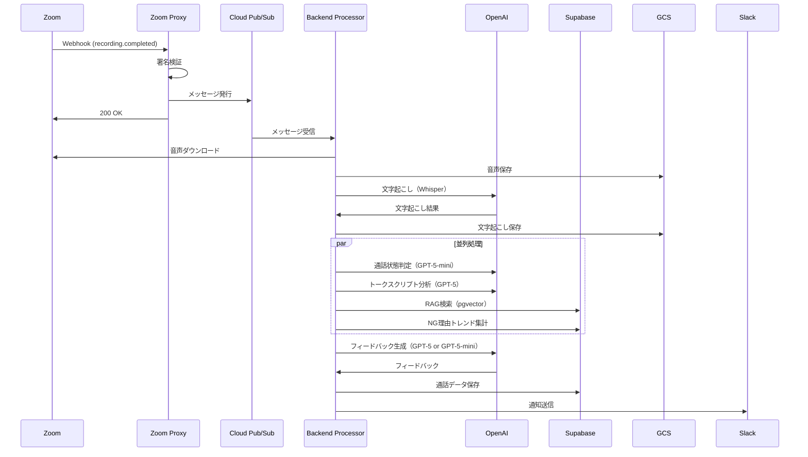

# システムアーキテクチャ設計書

**バージョン**: 1.0.0
**作成日**: 2025-01-15

---

## 目次

1. [システム概要](#システム概要)
2. [アーキテクチャ概要](#アーキテクチャ概要)
3. [コンポーネント設計](#コンポーネント設計)
4. [データフロー](#データフロー)
5. [技術スタック詳細](#技術スタック詳細)
6. [スケーラビリティ](#スケーラビリティ)
7. [セキュリティアーキテクチャ](#セキュリティアーキテクチャ)

---

## システム概要

Zoom Phone通話録音を自動処理し、営業フィードバック生成、感情分析、KPI管理を統合したWebアプリケーション。

### アーキテクチャパターン
- **フロントエンド**: SPA（Single Page Application）
- **バックエンド**: マイクロサービス + サーバーレス
- **データベース**: PostgreSQL（Supabase）
- **ストレージ**: オブジェクトストレージ（GCS）

---

## アーキテクチャ概要

```
┌──────────────────────────────────────────────────────────┐
│                      クライアント層                        │
│                                                          │
│  ┌──────────────┐  ┌──────────────┐  ┌──────────────┐ │
│  │  Web Browser │  │  Mobile App  │  │   Slack Bot  │ │
│  └──────┬───────┘  └──────┬───────┘  └──────┬───────┘ │
│         │                 │                 │          │
└─────────┼─────────────────┼─────────────────┼──────────┘
          │                 │                 │
          ↓                 ↓                 ↓
┌──────────────────────────────────────────────────────────┐
│                    アプリケーション層                       │
│                                                          │
│  ┌────────────────────────────────────────────────────┐ │
│  │         Next.js App (Vercel)                       │ │
│  │  ┌──────────┐  ┌──────────┐  ┌──────────┐        │ │
│  │  │   Pages  │  │   API    │  │   SSR    │        │ │
│  │  │   /app   │  │  Routes  │  │  Server  │        │ │
│  │  └──────────┘  └────┬─────┘  └──────────┘        │ │
│  └───────────────────────┼──────────────────────────┘ │
│                          │                             │
│  ┌───────────────────────┼──────────────────────────┐ │
│  │  Cloud Run Services   │                          │ │
│  │  ┌──────────┐  ┌──────┴──────┐  ┌────────────┐ │ │
│  │  │  Zoom    │  │  Backend    │  │   Worker   │ │ │
│  │  │  Proxy   │  │  Processor  │  │   Jobs     │ │ │
│  │  └──────────┘  └─────────────┘  └────────────┘ │ │
│  └─────────────────────────────────────────────────┘ │
└──────────────────────────────────────────────────────────┘
          │                 │                 │
          ↓                 ↓                 ↓
┌──────────────────────────────────────────────────────────┐
│                      データ層                             │
│                                                          │
│  ┌──────────────┐  ┌──────────────┐  ┌──────────────┐ │
│  │   Supabase   │  │     GCS      │  │   Redis      │ │
│  │  PostgreSQL  │  │  Object      │  │   Cache      │ │
│  │  + pgvector  │  │  Storage     │  │              │ │
│  └──────────────┘  └──────────────┘  └──────────────┘ │
└──────────────────────────────────────────────────────────┘
          │
          ↓
┌──────────────────────────────────────────────────────────┐
│                    外部サービス層                          │
│                                                          │
│  ┌──────────────┐  ┌──────────────┐  ┌──────────────┐ │
│  │  OpenAI API  │  │  Zoom API    │  │  Slack API   │ │
│  │  GPT-5       │  │  Phone       │  │  Webhook     │ │
│  │  Whisper     │  │  Recording   │  │              │ │
│  └──────────────┘  └──────────────┘  └──────────────┘ │
└──────────────────────────────────────────────────────────┘
```

---

## コンポーネント設計

### 1. フロントエンド（Next.js）

**責務**:
- ユーザーインターフェース提供
- クライアントサイドルーティング
- サーバーサイドレンダリング
- API Routesによるバックエンド連携

**主要ページ**:
```
/app
├── (auth)
│   ├── login/page.tsx
│   └── logout/page.tsx
├── dashboard/page.tsx
├── calls
│   ├── page.tsx
│   └── [id]/page.tsx
├── projects
│   ├── page.tsx
│   └── [id]
│       ├── page.tsx
│       ├── prompts/page.tsx
│       ├── talk-scripts/page.tsx
│       └── learning-materials/page.tsx
├── kpi/page.tsx
└── settings/page.tsx
```

**API Routes**:
```
/app/api
├── auth/
├── projects/
├── prompts/
├── talk-scripts/
├── learning-materials/
├── calls/
└── kpi/
```

---

### 2. バックエンド（Cloud Run）

#### 2.1 Zoom Proxy Service

**責務**:
- Zoom Webhook受信・検証
- イベント振り分け
- Backend Processorへの非同期処理依頼

**技術**:
- Node.js / TypeScript
- Express.js
- Cloud Pub/Sub（非同期キュー）

**処理フロー**:
```
1. Zoom Webhookを受信
2. 署名検証
3. イベントタイプ判定
4. Pub/Subにメッセージ発行
5. 即座に200 OKを返す
```

---

#### 2.2 Backend Processor Service

**責務**:
- 通話録音の処理
- AI分析（文字起こし、判定、フィードバック生成）
- データベース保存
- Slack通知

**技術**:
- Node.js / TypeScript
- OpenAI SDK
- Google Cloud Storage SDK
- Supabase Client

**処理フロー**:
```typescript
async function processCall(callId: string) {
  // 1. 音声ダウンロード
  const audioBuffer = await downloadAudioFromZoom(callId);
  await uploadToGCS(audioBuffer, `calls/${callId}.mp3`);

  // 2. 文字起こし（Whisper API）
  const transcript = await transcribeAudio(audioBuffer);
  await uploadToGCS(transcript, `calls/${callId}.srt`);

  // 3. 並列処理
  const [
    status,
    emotionAnalysis,
    ragResults,
    ngReasonTrends,
    scriptAnalysis
  ] = await Promise.all([
    determineStatus(transcript),          // GPT-5-mini
    analyzeEmotion(audioBuffer),          // 音声周波数解析
    searchLearningMaterials(transcript),  // RAG検索
    getNgReasonTrends(projectId),         // NG理由集計
    analyzeTalkScript(transcript, talkScript) // GPT-5
  ]);

  // 4. フィードバック生成判定
  if (status === 'connected' && duration >= 60) {
    const feedback = await generateFeedback({
      transcript,
      scriptAnalysis,
      ragResults,
      ngReasonTrends,
      useGPT5: ragResults.length > 0
    });

    // 5. AI判定
    const [appointment, validLead, ngReason] = await Promise.all([
      judgeAppointment(transcript),
      judgeValidLead(transcript),
      judgeNgReason(transcript, existingReasons)
    ]);

    // 6. データベース保存
    await saveCall({
      ...metadata,
      feedback,
      scriptAnalysis,
      appointment,
      validLead,
      ngReason
    });

    // 7. Slack通知
    await notifySlack(projectWebhookUrl, {
      status: 'connected',
      feedback,
      callUrl: `https://app.com/calls/${callId}`
    });
  } else {
    // フィードバック生成なし
    await notifySlack(projectWebhookUrl, {
      status: status === 'connected' ? 'つながっただけ' : status,
      callUrl: `https://app.com/calls/${callId}`
    });
  }
}
```

---

#### 2.3 Worker Jobs Service

**責務**:
- 定期実行ジョブ
- データクリーンアップ
- 集計処理

**ジョブ一覧**:
```typescript
// 1. 6ヶ月後のデータ削除（毎日2時実行）
async function cleanupOldCalls() {
  const sixMonthsAgo = new Date();
  sixMonthsAgo.setMonth(sixMonthsAgo.getMonth() - 6);

  await supabase
    .from('calls')
    .delete()
    .lt('call_time', sixMonthsAgo.toISOString());
}

// 2. GCS Lifecycle設定（自動）
// 6ヶ月後に自動削除される設定を適用
```

---

### 3. データベース（Supabase）

#### 3.1 PostgreSQL設定

```sql
-- 拡張機能
CREATE EXTENSION IF NOT EXISTS "uuid-ossp";
CREATE EXTENSION IF NOT EXISTS "pg_cron";
CREATE EXTENSION IF NOT EXISTS "vector";

-- pgvector設定
CREATE INDEX ON learning_material_embeddings
USING ivfflat (embedding vector_cosine_ops)
WITH (lists = 100);
```

#### 3.2 Row Level Security (RLS)

```sql
-- ユーザーは自分の通話のみ閲覧可能
CREATE POLICY "users_own_calls"
ON calls FOR SELECT
USING (
  auth.uid() = user_id
  OR
  EXISTS (
    SELECT 1 FROM project_members pm
    WHERE pm.project_id = calls.project_id
      AND pm.user_id = auth.uid()
      AND pm.role = 'director'
  )
  OR
  EXISTS (
    SELECT 1 FROM users u
    WHERE u.id = auth.uid() AND u.role = 'owner'
  )
);
```

---

### 4. ストレージ（GCS）

#### 4.1 バケット構成

```
bucket: zoom-phone-feedback-prod
├── calls/
│   ├── {call_id}/
│   │   ├── audio.mp3
│   │   ├── transcript.srt
│   │   └── emotion_analysis.json
├── learning-materials/
│   ├── {project_id}/
│   │   ├── detail/
│   │   │   └── {material_id}.pdf
│   │   └── case_study/
│   │       └── {material_id}.pdf
└── talk-scripts/
    └── {project_id}/
        └── {script_id}.pdf (PDF取り込み時の元ファイル)
```

#### 4.2 Lifecycle設定

```json
{
  "lifecycle": {
    "rule": [
      {
        "action": {
          "type": "Delete"
        },
        "condition": {
          "age": 180,
          "matchesPrefix": ["calls/"]
        }
      }
    ]
  }
}
```

---

## データフロー

### 通話処理フロー



---

## 技術スタック詳細

### フロントエンド

```json
{
  "framework": "Next.js 14",
  "language": "TypeScript",
  "ui": "shadcn/ui + Tailwind CSS",
  "stateManagement": "Zustand",
  "dataFetching": "TanStack Query (React Query)",
  "forms": "React Hook Form + Zod",
  "charts": "Recharts",
  "authentication": "@supabase/auth-helpers-nextjs"
}
```

### バックエンド

```json
{
  "runtime": "Node.js 20",
  "language": "TypeScript",
  "framework": "Express.js",
  "validation": "Zod",
  "database": "@supabase/supabase-js",
  "storage": "@google-cloud/storage",
  "ai": "openai",
  "queue": "@google-cloud/pubsub"
}
```

---

## スケーラビリティ

### 水平スケーリング

**Cloud Run**:
- 最小インスタンス: 1
- 最大インスタンス: 100
- 同時リクエスト数: 80/インスタンス
- オートスケーリング: CPU使用率60%

**Supabase**:
- Connection pooling: PgBouncer
- Read replica: 必要に応じて追加

### 垂直スケーリング

**Cloud Run**:
- CPU: 2 vCPU
- Memory: 4 GiB
- リクエストタイムアウト: 300秒

---

## セキュリティアーキテクチャ

### 認証・認可

```
┌─────────────┐
│   Client    │
└──────┬──────┘
       │ 1. Login Request
       ↓
┌─────────────────┐
│  Supabase Auth  │
│  - Google OAuth │
│  - Email/Pass   │
└──────┬──────────┘
       │ 2. JWT Token
       ↓
┌─────────────┐
│  Next.js    │
│  Middleware │ ← 3. Token Verification
└──────┬──────┘
       │ 4. Authorized Request
       ↓
┌─────────────┐
│  Supabase   │
│  RLS Check  │ ← 5. Row Level Security
└─────────────┘
```

### データ暗号化

- **転送中**: TLS 1.3
- **保存時**:
  - Supabase: AES-256
  - GCS: Google-managed encryption keys

### アクセス制御

- **Supabase**: Row Level Security (RLS)
- **GCS**: Signed URLs（有効期限: 1時間）
- **API**: JWT Bearer Token

---

**以上**
